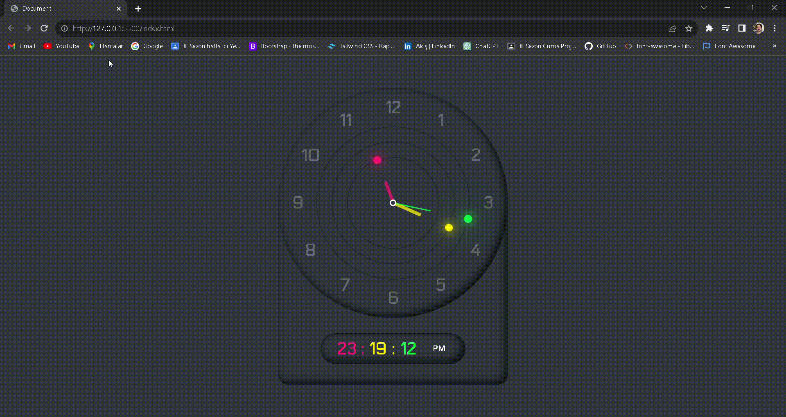

<h2>⏰ **HTML, CSS ve JavaScript ile Basit Saat Tasarımı** ⏰</h2>

🚀 HTML, CSS ve JavaScript kullanarak basit ve şık bir saat tasarımı oluşturdum. Bu proje, klasik bir daire formunda olan analog bir saat ve zamanı hızlıca gösteren dijital bir saat içeriyor.

- 🕒 **Analog Saat:** Göze hoş gelen klasik bir tasarım.
- ⏱️ **Dijital Saat:** Net ve modern dijital ekran.

Kodu kontrol etmeye ve kendi tarzınıza uyarlamaya özgürsünüz! ⚙️✨

<h2>Ekran görüntüsü</h2>

